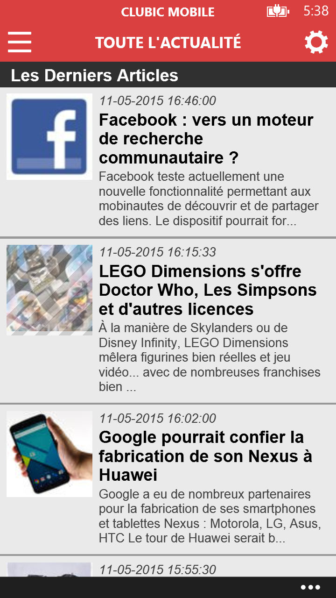
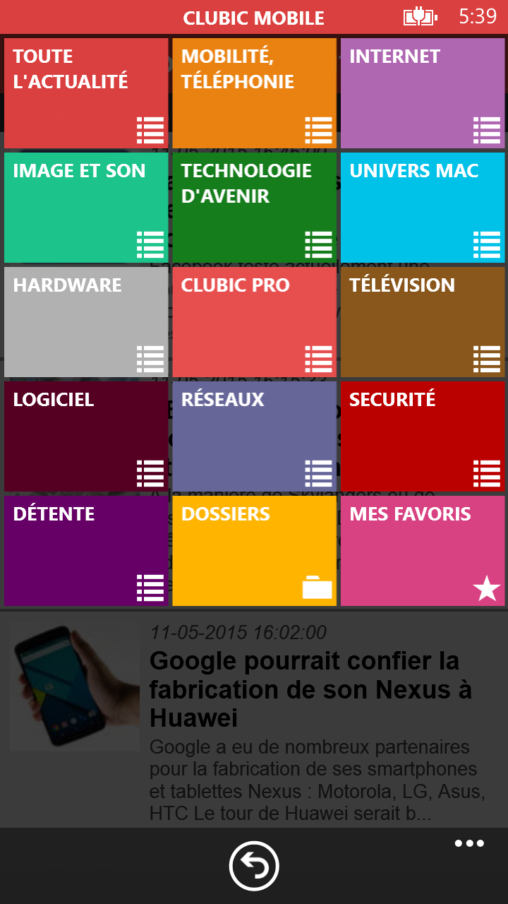
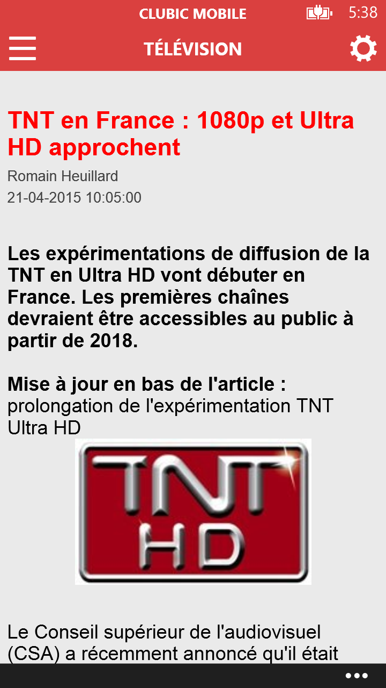

# Application Clubic Mobile pour Windows Phone et Windows Mobile 10

A la suite de la fermeture du Store pour Windows 10 - je publie mes applis au cas où cela serait utile à quelqu'un.

L'application sur le store : [Clubic Mobile](https://www.microsoft.com/store/apps/9NBLGGH0HDGK).

### Raison du projet

Cette application avait pour but de pouvoir accéder aux news de Next INpact depuis un Windows Phone, aucune application de tel n'ayant existée.

### Description sur le store

```console
Suivez l'actualité High-Tech sur Windows Phone.

Application non officielle gérant les différentes sections.
```

### Ouverture du projet

```console
Utilisez Microsoft Visual Studio 2013 avec le SDK Windows Phone 8.1
```

### Précisions

Ce projet n'est plus en mesure de récupérer les news de Clubic, l'api rest ayant été fermée :(

### Quelques captures

<p align="center">
 </br>
 
 &nbsp;
 
 &nbsp;
 
</p>
